# Geo Quiz Website

Test your geography skills with Geo Quiz! This game features three levels where the questions become harder and harder, allowing users to really test their knowledge and hopefully learn new, fascinating facts about geography. There are ten questions in each round, totaling thirty multiple choice questions. The user must beat each level before moving onto the next, or else they will have to start over again.

[View live project here](https://lee-joanne.github.io/geo-quiz/)

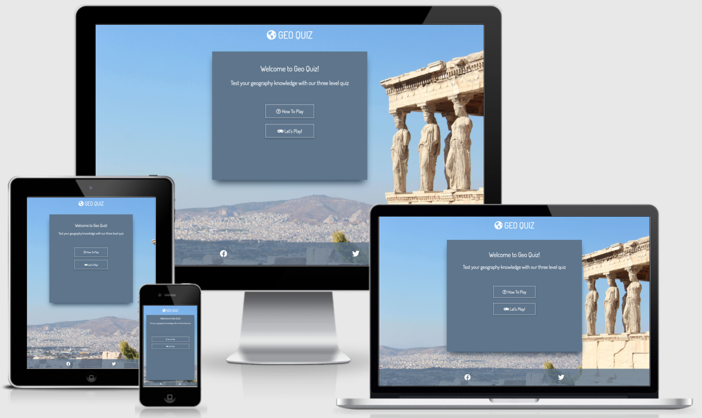

## User Experience (UX)

* ### User Stories
  - First Time Visitor Goals

    1. As a First Time User, I want to fully understanding what this game is and the purpose of it the moment I enter the website. I can clearly see the purpose of the game in the title and headings of the website that it is a geography quiz to test my knowledge in geography.

    2. As a First Time User, I want to be able to understand how to play this game and what to expect. I can clearly see the 'How To Play' button which shows me thorough instructions in a modal window. I can clearly explained that I must score 6 points to beat level 1, 12 points to beat level 2, and 20 points to beat the game. The rules to beat the levels are in a list so I can clearly distinguish the rules from the rest of the instructions. 

    3. As a First Time User, I want this website to be easy on the eyes and easy to navigate. I can clearly see that the website is nicely designed and everything is clearly placed. The title of the website is large at the header, the 'Let's Play' and 'How To Play' buttons are large and very visible so I know exactly how to navigate myself around the website. There are icons on the buttons as well, 'How To Play' resembling a question mark and 'Let's Play' featuring a game controller. This makes the website intuitive and I know exactly what each button will do before I even have to read them. 

    4. As a First Time User, I want to understand how many scores I have and if I have won the game or not. When I play the game, I can see the score at the top incrementing by 1 each time I get a question correct. The game also gives me feedback whether the answer is correct or not. If I guess incorrect, the game will tell me what the answer was. 
 
  - Returning / Frequent Visitor Goals

    1. As a Returning and Frequent Visitor, I want to be able to play this game again and have my score reset and the questions shuffled. At the 'game over' or 'level three completed' page, there is a button to play again that refreshes the entire page back to the homepage. Here, I can refresh my memory with the rules on how to beat each level and play the game from scratch and with shuffled questions. 

    2. As a Returning and Frequent Visitor, I want to be able to keep in touch with the creator of the website or perhaps keep in touch with updates to the game. When I scroll down, I see there are social media links at the bottom that I can click on and takes me to a different tab so I do not navigate out of the game website.

* ### Design
  - Colour Scheme

    1. Blue (#5D748D)
    2. White
    3. Darker Blue (#254153)
    4. Black

    - The main colours I have selected for this website are blue (#5D748D), white, darker blue (#254153), and black. The main background image of the game is of blue skies and Greek statues. To adhere to the background image, the #5D748D shade of blue matches nicely and therefore was used as container for the game itself. The blue (#5D748D) shade was also used for the footer container with slight opacity to make it look more appealing. The buttons for the main functions of the game ('How To Play', 'Let's Play', multiple choice options) are also blue (#5D748D) with white bordering. White was used as the font colour (text and social media icons) to contrast nicely with the blue (#5D748D) background for high accessibility. The darker blue (#254153) shade was used for the 'Next', 'Play Again', and 'Let's Go' buttons to differentiate them from the multiple choice buttons or when the user will be moving onto the next part of the quiz. The darker blue (#254153) serves the purpose of signalling the user they have reached an 'end' (end of the question, end of the level, end of the game) and the button will take them to the next part. Black is used for social media links and 'X' in modal window instructions being hovered over to contrast the blue (#5D748D) background. 

  - Typography

    1. Dosis
    2. Sans Serif (fallback)

    - The main font used is Dosis, as Sans Serif as the fallback font. Dosis is a rounded sans-serif type family, which makes the font look very readable to increase accessibility. The font looks very playful and eyecatching which compliments well with the purpose of the website. 

  - Imagery

    - The background image contains a gorgeous photo of blue sunny skies and the Erechtheion temple in Athens, Greece. This ancient temple photo is extremely eyecatching, minimalistic, and bright which will give users a sense of welcome and excitement while preparing for the quiz. This background photo is perfect for the quiz because the Erechtheion temple is conveniently on the right side of the quiz game. Therefore, the imagery does not clash. The image goes perfectly well with the blue (#5D748D), white, and darker blue (#254153) colours selected. 

* ### Wireframes
  - Low-fidelity wireframes have been created using the program Balsamiq.

    - Desktop Wireframe - [View](assets/documentation/desktop-wireframe.png) 

    - Mobile Wireframe - [View](assets/documentation/mobile-wireframe.png)

    - Tablet Wireframe - [View](assets/documentation/tablet-wireframe.png) 

## Features

* ### Existing Features

- Logo
  -  The logo is an h1 heading at the very top of the game. A Font Awesome icon of the earth is included to make the logo look more appealing and related to the game. The user can fully understand the theme of the quiz without having to read much further. The white font of the logo contrasts the conveniently blue background image so increase acessibility for the user. The logo also serves as a link to redirect the user to the index.html page, which will ultimately refresh the game. 

  

- Footer
  - The footer is at the very bottom of the page, with two social media icons large and in white. The icons are very spread apart so the user can easily click on the social media icon they wish. The icons are white to contrast the blue (#5D748D) footer container. The footer container contains opacity to make the footer look more appealing, rather than having a solid blue (#5D748D) line running across the bottom of the user's page. The icons will become black when hovered over, to assure the user the buttons are clickable and the user is about to select the correct one. 

  

- Homepage
  - The homepage of the game consists of a solid blue (#5D748D) container (div) with white font for high accessibility. The h2 heading welcomes the user to the game and the h3 heading gives a brief introduction of the game's purpose. After the headings, there are only two buttons available to make the homepage look clean, neat, and minimalistic without trying to confuse the user. The buttons clearly state their purpose, the first one 'How To Play' with a question mark icon and the other, 'Let's Play' with a game controller icon. The users are able to easily identify the purpose of the two buttons by the icons without having to read much further. The buttons are blue (#5D748D) with white bordering and font. When hovered over, the buttons will become white with blue (#5D748D) font to assure the user that the buttons are clickable and the user is about to select the correct one. 

  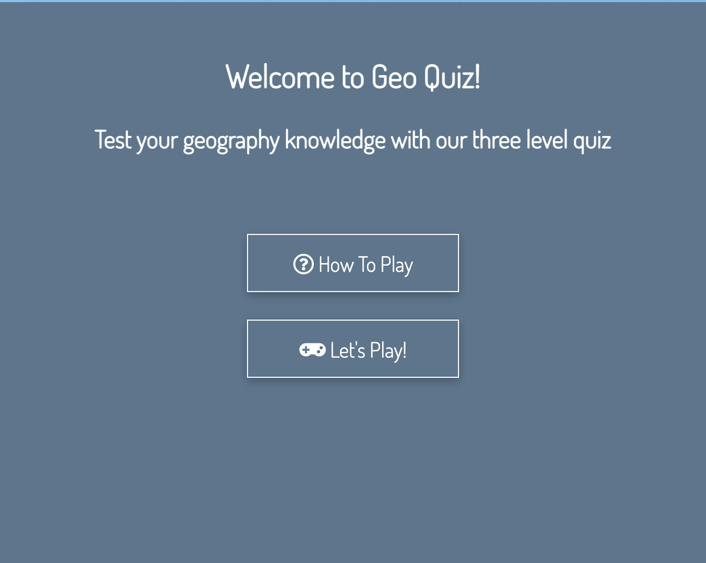

- How To Play - Instructions
  - When the user clicks the 'How To Play' button, a modal window will pop up. Behind the modal window, the page will become very dark as the focus goes straight to the modal window. The user is able to read the h3 heading the purpose of the modal window, which is to learn how to play the game. Thorough instructions are given to the user on what to expect from the game. The rules on how to beat the levels are in an unordered list to make the rules stand out from the rest of the text. The font is white and the modal window is blue (#5D748D) to match the blue theme of the game. There is an 'X' icon at the top left corner of the modal window for the user to close the modal window. The 'X' icon becomes black when hovered to assure the user the button is clickable and the user is about to click the correct button. 

  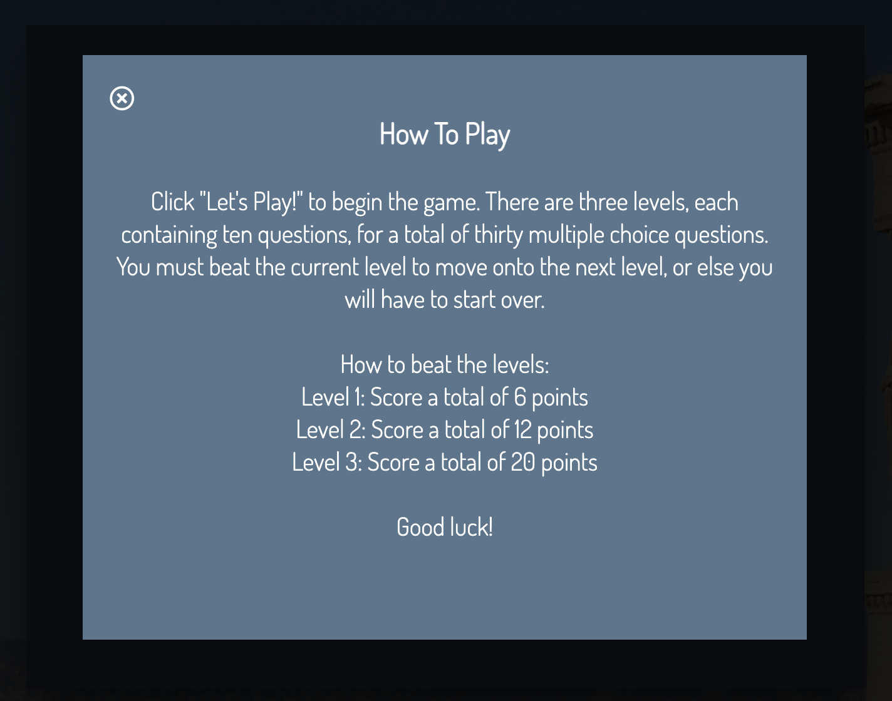

- Question Area
  - When the user clicks the 'Let's Play' button, the homepage container contents will be cleared out and the user will be shown the question area. The score count is at the top of the game, always starting at 0 to indicate a new game. The question will be shown below. There will be four buttons containing possible answers. The button style is similar to the homepage container: blue (#5D748D) with white bordering/font which becomes white and has blue (#5D748D) font when hovered over. The game and questions are fully responsive on mobile, tablet, laptop, and desktop viewports. 

  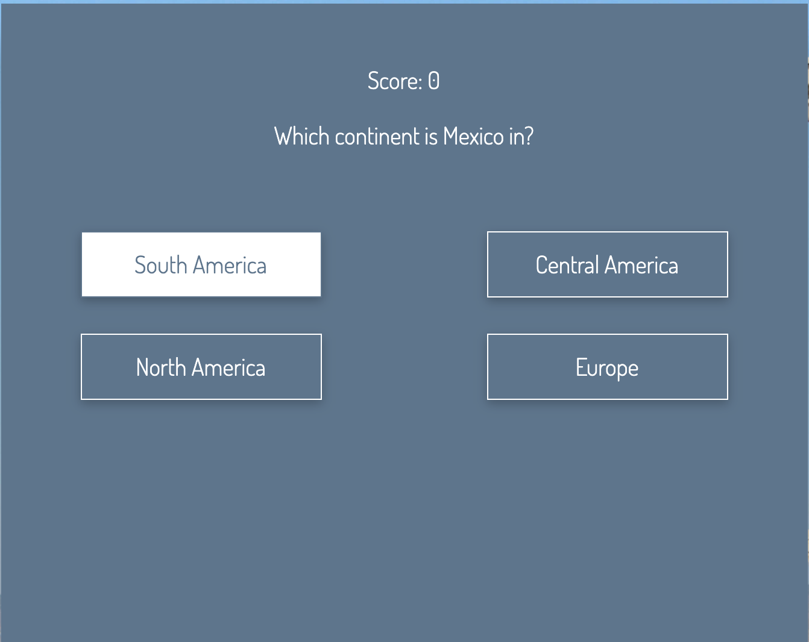
  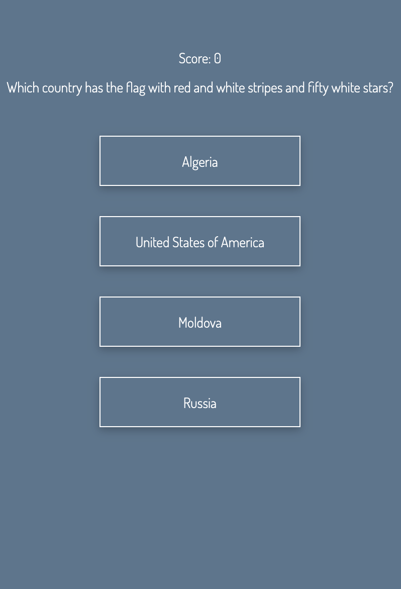

- Incorrect Answer
  - When the user answers the question incorrectly, the game will immediately give feedback to the user apologizing and giving the correct answer of the question. The 'Next' button will then appear in darker blue (#254153). This shade of blue is used to help differentiate the purpose of the 'Next' button from the other buttons. The multiple choice buttons have been disabled so they will no longer be hovered over nor clickable, so the user is not able to cheat and try again. The 'Next' button will take the user to the next question. The purpose of the design to make the user click 'Next' first before moving onto the next question is to give the user time to read feedback and to re-read the question and the answer to allow the users to learn geography. 

  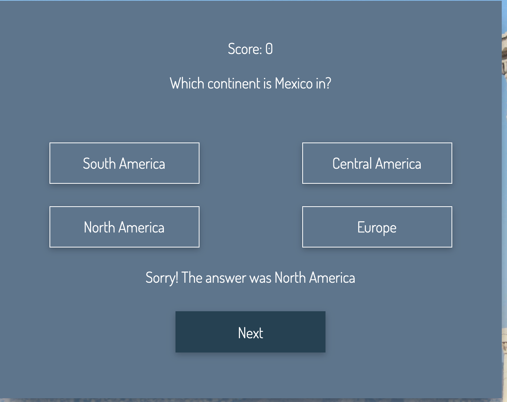

- Correct Answer
  - When the user answers the question correctly, the game will give feedback to let them know they are correct. The score at the top of the question area will increment by 1 each time the user gets a correct answer. The 'Next' button will pop up again to prompt the user to move onto the next question. 

  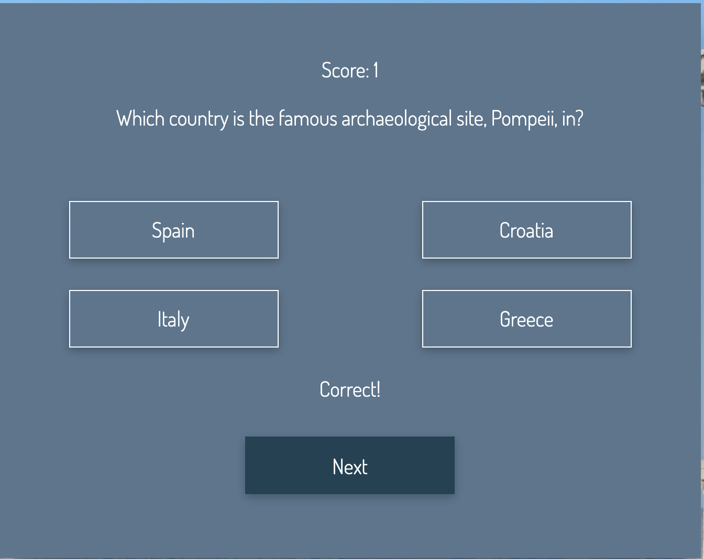

- Level One Complete
  - When the user completes level one after scoring a minimum of 6 points, the game will congratulate the user to make the user feel happy. The message also has a smiley face. The message warns the user that the questions will get harder from here and allows the user to click the 'Let's Go!' button which will move onto the next round. The darker blue (#254153) shade is used here to contrast from the other buttons, because this button will allow the user to move onto the next round of the game, signalling the 'end' of level one. The button will become white when hovered. 

  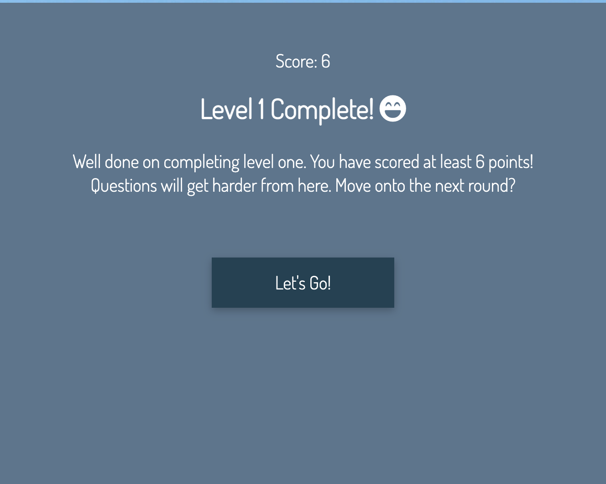

- Level Two Complete
  - When the user completes level two after scoring a minimum of 12 points, the game will again show a smiley face and congratulate the user for completing level two. The game will warn the user again the next level will be hard and allows the user to click the 'Let's Go!' button to move onto the next round. 

  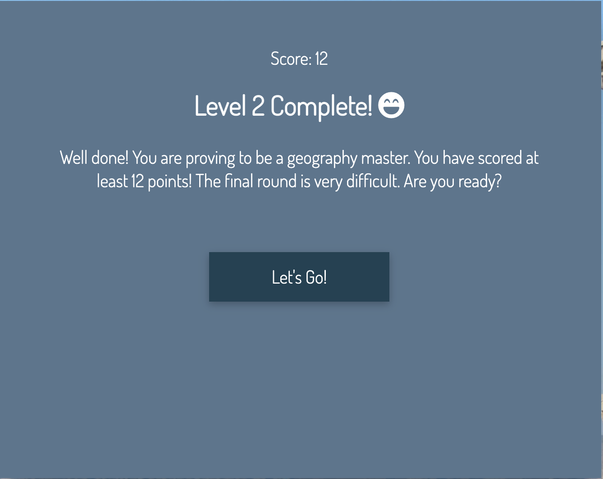

- Game Complete
  - When the user completes the final round after scoring a minimum of 20 points, the game is complete. A medal icon is shown and the game congratulates the user. The game allows the user the option to play again, and warns the user that the 'Play Again' button will refresh the page to reset the score and reshuffle the quiz questions. A warning is shown to the user first because some users might find refreshing to be an inconvenience so it is better to have users prepared first. Therefore, it is best to explain the purpose of refreshing, which is to reset the score and reshuffle the quiz. The button will become white when hovered. 

  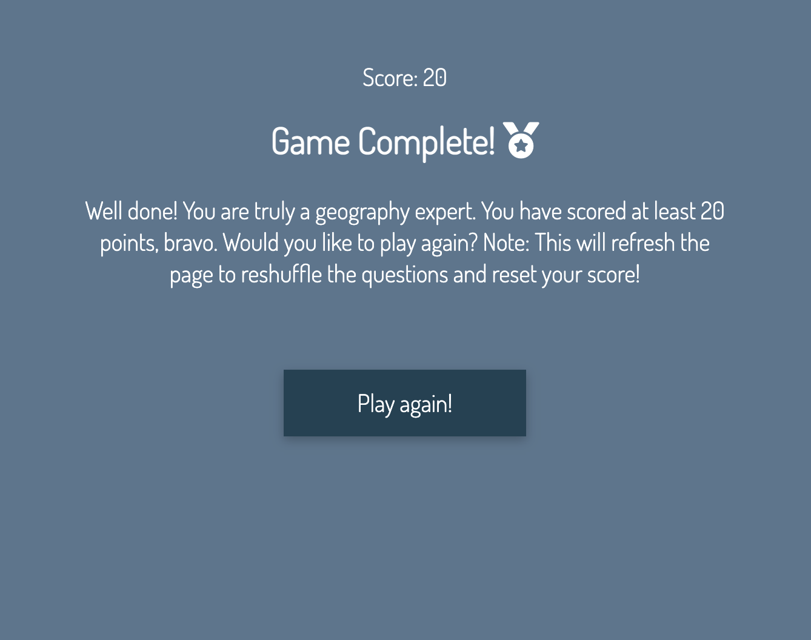

- Game Over 
  - When the user fails to reach the minimum points to move onto the next level, a game over message will show with a sad face and an apologetic message. The game allows the user the option to play again, and again warns the user that the 'Play Again' button will refresh the page to reset the score and reshuffle the questions. The button will become white when hovered. 

  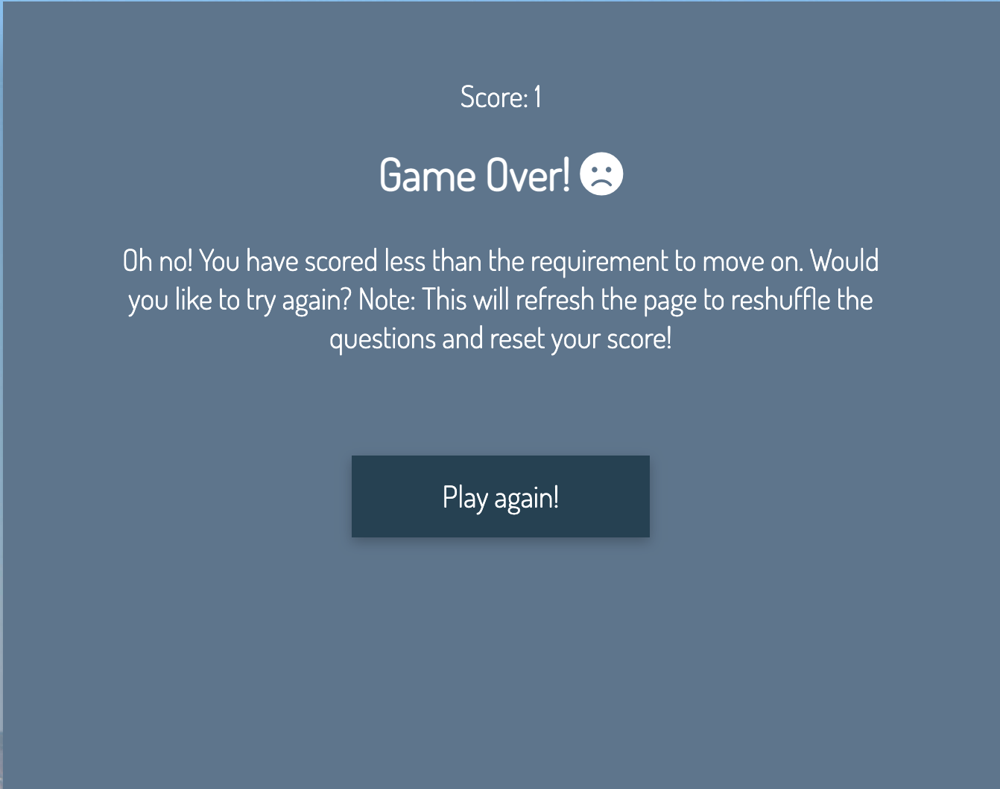

* ### Features Left to Implement

  - In the future, I would like to create a form where users can create a username for themselves to have the game more personalized. I would like the game to be able to store score histories so the user is able to refer back to old scores and see if they can beat their previous scores. This feature will be highly beneficial for Returning / Frequent Visitors of the website. 

  - I would like to add levels where the questions consist of labelling maps and identifying flags. This feature would make the game even more interactive and more visual for the users to test out a variety of geography skills. 

## Technologies Used

* ### Languages Used

  - [JavaScript](https://www.javascript.com/)
  - [HTML5](https://en.wikipedia.org/wiki/HTML5)
  - [CSS3](https://en.wikipedia.org/wiki/CSS)

* ### Frameworks, Libraries & Programs Used

  1. [Google Fonts](https://fonts.google.com/)
      - Google Fonts was used to import the font Dosis. Information on Dosis for this README is also taken from Google Fonts.
  
  2. [Font Awesome](https://fontawesome.com/) 
      - Font Awesome was used throughout the pages for their icons to make the page look more aesthetically pleasing.

  3. [Balsamiq](https://www.balsamiq.com/)
      - Balsamiq was used to create low-fidelity wireframes of the website. 

  4. [Git](https://git-scm.com/)
      - Git was used by utilizing the Gitpod terminal to commit to Git and Push to GitHub.

  5. [GitHub](https://github.com/)
      - Git was used to store the project code after being pushed in by Git. GitHub Pages was also used to deploy the project to create a public link.

  6. [Pexels](https://www.pexels.com/)
      - Pexels was used for the background image of the Erechtheion temple in Athens, Greece. The background image is used to make the website look more eyecatching and to match the theme of the quiz. 

  7. [ColorZilla](https://www.colorzilla.com/)
      - ColorZilla Chrome extension was used to select the blue (#5D748D) colour by using this tool on the background image to identiy the main colour scheme of the website.
  
  8. [Tinypng.com](https://tinypng.com/)
      - Tinypng was used to compress the background image to enhance performance speed.

  9. Beautify
      - Beautify Command Palette on Git was used to organize the code in all html and CSS files.

  10. [Ecotrust-Canada Markdown-toc](https://ecotrust-canada.github.io/markdown-toc/)
      - Ecotrust-Canada Markdown was used to create the table of contents for this README. 

## Testing

* ### Validator Testing

To accurately test the code of the website, JSHint, the W3C Markup Validator, W3C CSS Validation Service were used to validate all code used in the project to spot any errors in the syntax. No errors were found in the JS, HTML, and CSS files. 

  - [JSHint](https://jshint.com/)
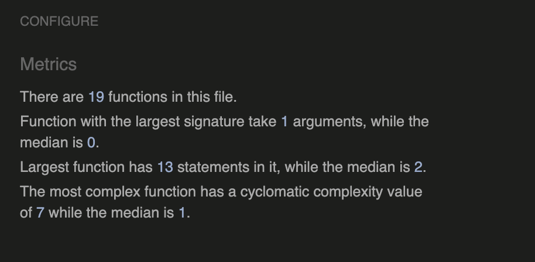

  - [W3C Markup Validator](https://validator.w3.org/)
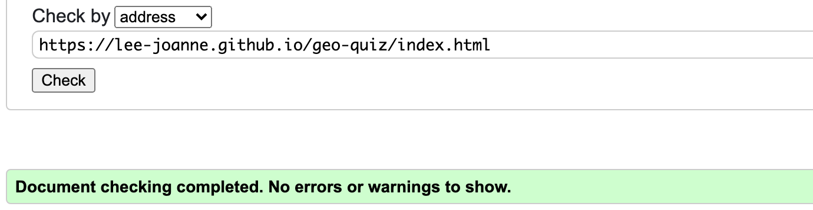 

  - [W3C CSS Validation Service](https://jigsaw.w3.org/css-validator/)
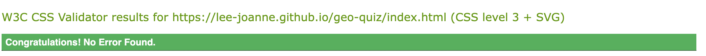 

* ### Accessibility Testing

The website was also tested on Lighthouse to test accessibility. When tested, accessibility scored 100. 

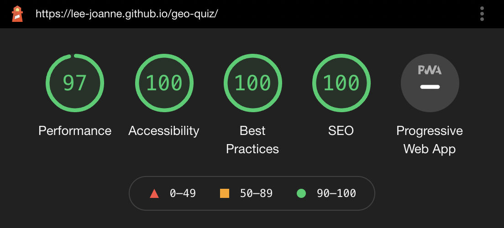 

* ### Unfixed Bugs

